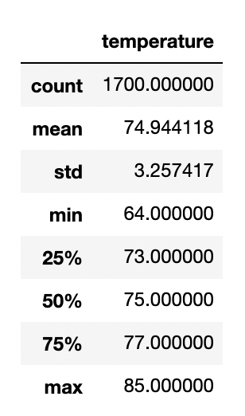
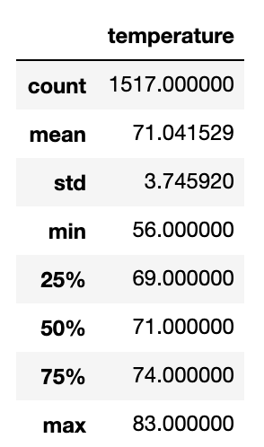

# surfs_up
SQLite, SQLAlchemy

## Overiview
The purpose of this analysis is to provide key information on two specific months, June and December, to determine whether opening a surf and ice cream shop is sustainable year-round. During the module it was evident that temperatures stayed between 60 and 85 degress fahrenheit throughout the year 2017, accoriding to our most active temperature tracking station. June and December are perfect months to look at becasue June will start the summer and have close to the highest temperatures during the year, while Decemebr will contain the lower temperatures during the year. Once we have our minimum, maximum and average temperatures for each month, we can decide on keeping the shop open all year or not.    

## Results
### June

- Min Temp: 64°
- Max Temp: 85°
- Average Temp: 75° 

### December

- Min Temp: 56°
- Max Temp: 83°
- Average Temp: 71°

## Summary

The loswest temperature recorded during June is 64° while the highest recorded temperature is 85°. The average temperature during the month of June is 75°. June will be a perfect time to have the surf and ice cream open for locals and tourists.

The lowest temperature recorded during December is 56°, while the highest was 83°. The average temperature during this month is 71°. People may not be too keen for ice cream during in 56° weather, however with the mean temperature at 71° there is optimism in sustaining a year-long business. 

We can run two extra queries to gather more information on from the months of June and December. The first query we could run might involve measuring precipitation during these months. Gathering our precipitation data for June and December would tell us that even if temperatures are high during these months, wet weather would prevent people from buying ice cream.
```
results = session.query(Measurement.date, Measurement.prcp).filter(Measurement.date == June).all()
```

The second query we could run could involve surfing conditions during June and December. If we measure the behavior of waves during these months it tell us how often people would come in for surf apparel or renting boards. We would need more data in order to execute this query. However, finding trends in monthly surf conditions would save the company money once knowing if the surf will be good enough to keep the business open annually, or to close the shop for winter, for example. 
